## 介绍
> **Git（读音为/gɪt/）是一个开源的分布式版本控制系统，
> 可以有效、高速地处理从很小到非常大的项目版本管理。 
> [1]也是Linus Torvalds为了帮助管理Linux内核开发而开发的一个开放源码的版本控制软件。**

可以理解为一个本地的文件仓库， 你可以创建一个仓库， 然后管理里面的文件（修改，添加，删除）， 
每次提交都会产生一个版本， 假如你突然想回到之前的某一个版本， 可以通过git命令进行回退到之前的修改。
也可以多个人协作去管理一个仓库。

## 下载安装Git
**[官网下载地址](https://git-scm.com/downloads)**，直接下载最新版本即可

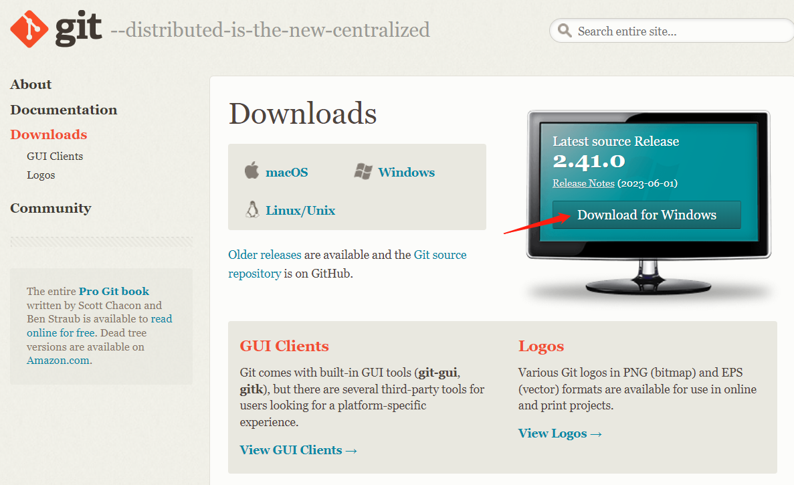

接着点击下载的安装包，选择安装路径，一直下一步直到安装完成。

验证安装： 在命令行输入git version 得到输出的git版本信息即代表安装成功

## 使用Git
配置git用户信息
```shell
git config --global user.name=“用户名”
git config --global user.email=“邮箱”
```

1. 创建一个文件夹（作为我们要管理的仓库）
2. 初始化git仓库
cmd进入命令行, 在该目录下执行 **git init** 命令进行初始化仓库
3. 接着我们可以在仓库目录下进行文件的添加，修改，删除
4. 使用 **git status** 命令查看当前仓库的状态，发现红色的文件名，为我们新增的文件
5. 使用 **git add .** 命令将发生改变的文件提交到暂存库中，可以理解为一个编辑修改的区域
6. 使用 **git status** 命令查看当前仓库的状态，发现绿色的文件名，为我们已添加到暂存库中的文件
7. 使用 **git commit** 命令提交一个版本
8. 使用 **git log** 命令查看我们提交的版本记录
9. 使用 **git reset --hard [版本号]** 命令可以回退到某个版本

具体操作如下：

创建一个myblog文件下，命令行进入该目录

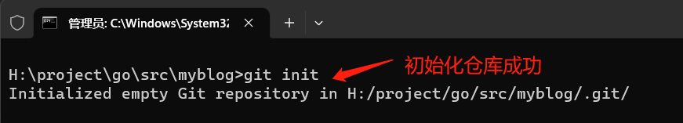 

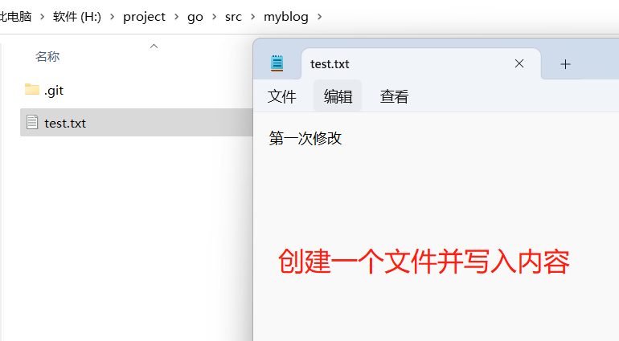

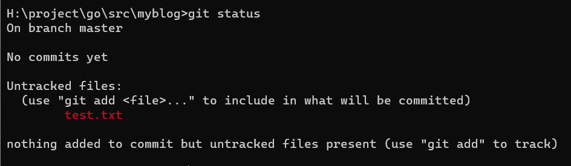

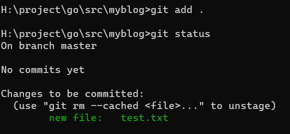

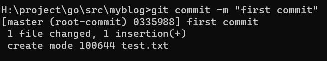

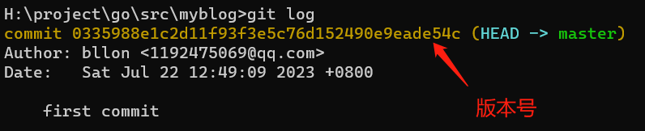

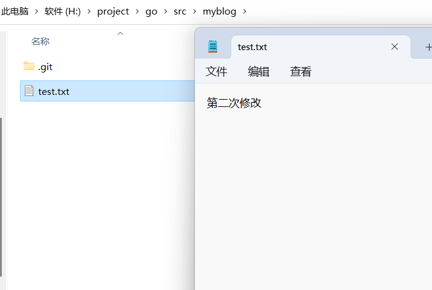

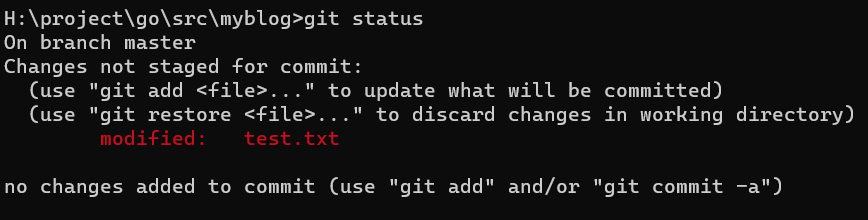

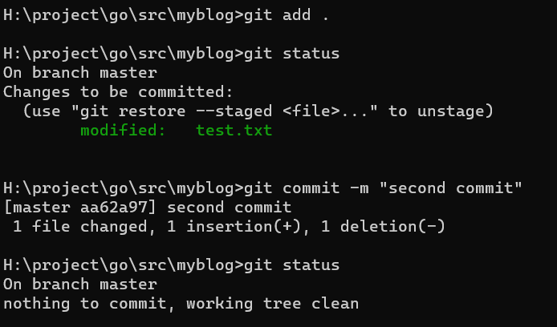

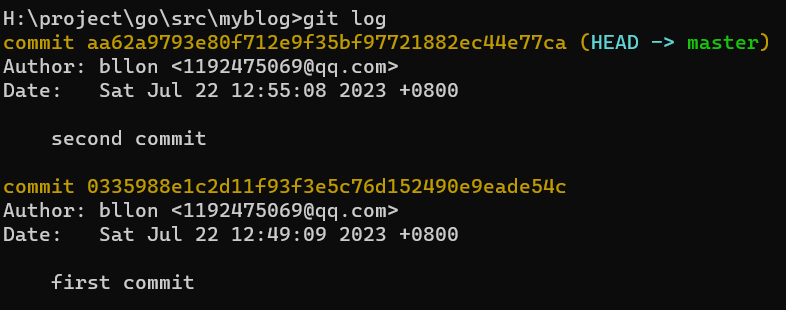

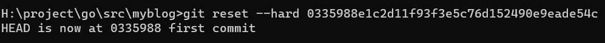


git还有其他很多命令，可以参考学习 [Git菜鸟教程](https://www.runoob.com/git/git-tutorial.html)

## Github注册使用
**Github可以理解为一个远程的仓库，我们可以把本地仓库和远程仓库关联起来，
进而每次提交版本都可以将文件推送到远程仓库，也可以将远程仓库下载到本地**

### 注册
在 **[Github网站](https://github.com/)** 注册一个账号，点击Sign up一般使用邮箱注册即可，

注册完点击Sign in登录

点击右上角头像，点击Your repositories进入自己的仓库列表页面， 点击New新建一个远程仓库，只需要填写仓库的名字即可

我这里创建一个test的仓库

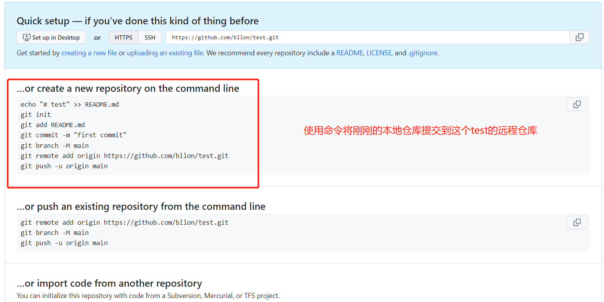

### 提交到远程仓库
由于我们前面仓库已经建好了，所以不需要前面的git init等初始化操作

第一次提交需要登录远程仓库，需要使用Github的邮箱账号密码，

或者使用Token （个人头像下的Settings中，Developer Settings下Personal access tokens (classic)，New一个新的token，
只需要勾选repo和workflow权限即可）

依次执行
```shell
git remote add origin https://github.com/bllon/test.git

git push -u origin master
```

再此刷新远程仓库页面，即可看到我们的仓库文件
