## 介绍
**[官方下载文档](https://gohugo.io/installation/windows/)**

**[Hugo中文文档](https://www.gohugo.org/)**
> **Hugo是由Go语言实现的静态网站生成器。简单、易用、高效、易扩展、快速部署。**

## 下载
以下两种方式，任选其中一种。当然官方也提供了其他方式，执行对应的命令即可。
1. 对于开发者，可以选择源代码构建方式，前提是需要安装Git和Go以及gcc编译器，这些我在其他文章都有介绍
```shell
go install -tags extended github.com/gohugoio/hugo@latest
```

2. 对于新手小白或者只想简单的搞一个博客，推荐使用winget安装方式，这是微软自带的免费的包管理器
```shell
winget install Hugo.Hugo.Extended
```

## 选择博客主题模板
我选的是这款 **[Stack](https://themes.gohugo.io/themes/hugo-theme-stack/)**

**[Github地址](https://github.com/CaiJimmy/hugo-theme-stack-starter)**

## 运行
1. 将上方的Github仓库下载下来
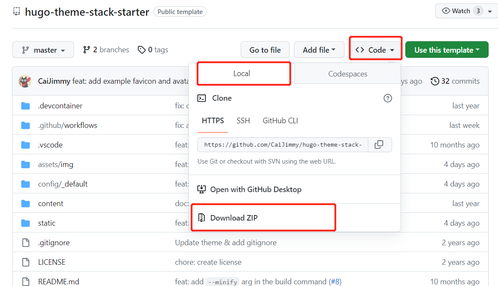
2. 解压，然后把文件夹改成你想要的名字
3. cmd进入命令行，进到该目录下，输入hugo server回车，服务就会启动，给出对应的博客地址：http://localhost:1313/
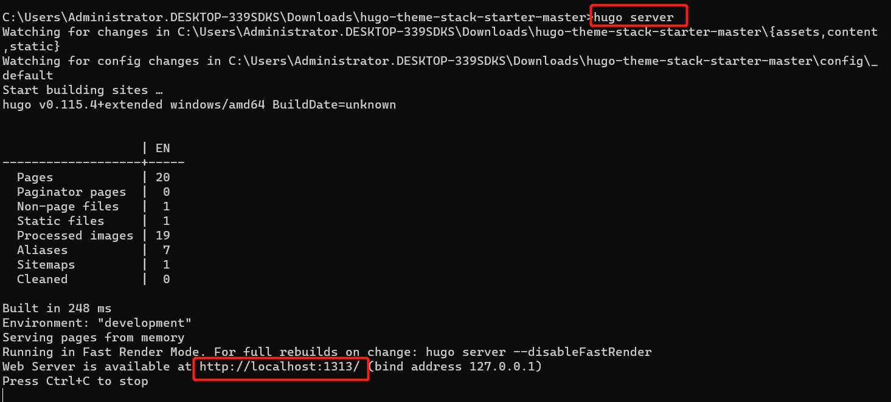
4. 浏览器进入博客网站
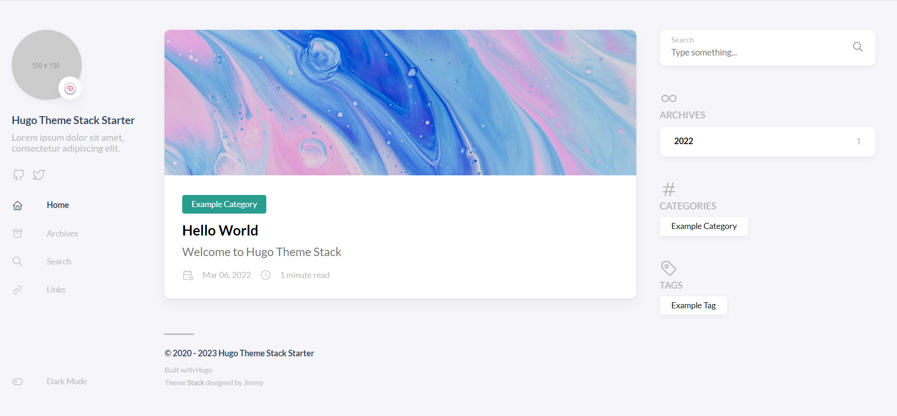

至此博客基本搭建完成

## 网站配置
所有的配置文件都在config/_default目录下，我们在修改内容的同时，网站会实时进行更新
### 修改网站标题
config.toml
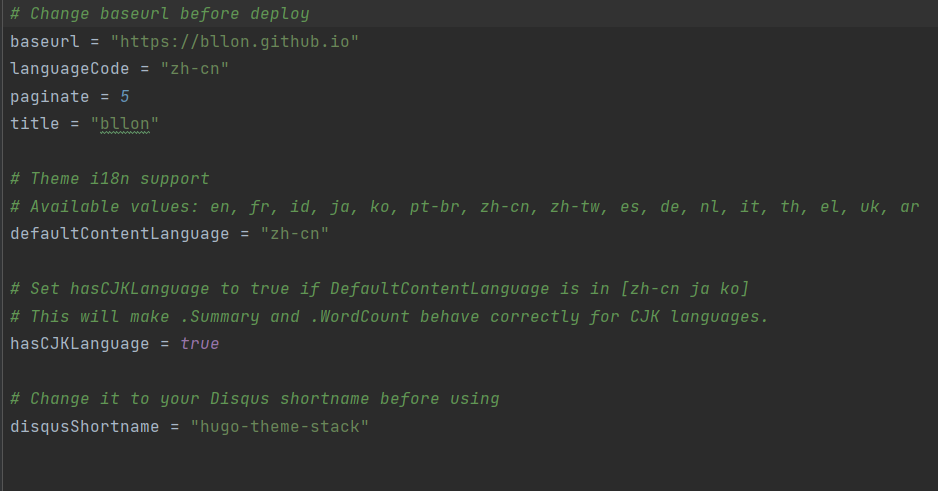

### 修改菜单
menu.toml

我们可以在 **[阿里图标库](https://www.iconfont.cn/)** 下载我们喜欢的图标，svg格式，我是用的是128大小，070707颜色
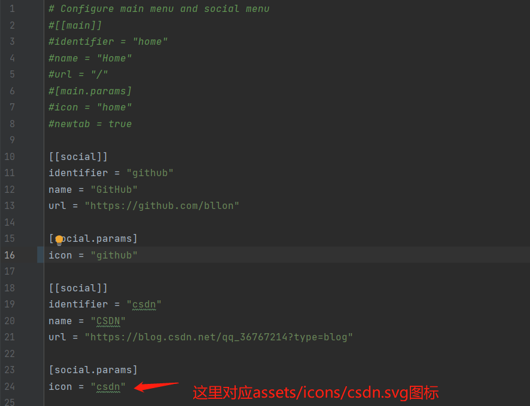

### 修改副标题
params.toml
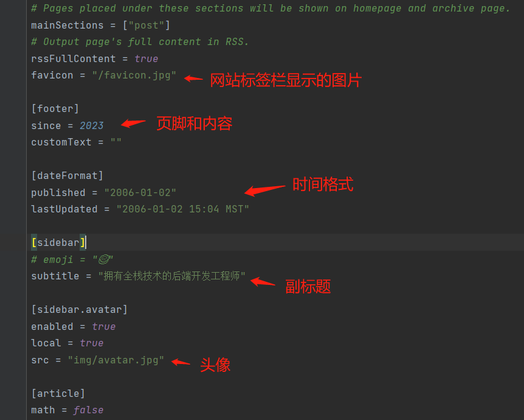

### 新建文章
在content/post目录下，每个文件夹对应一篇文章，新建index.md（也可以通过hugo命令方式创建），里面就是写文章的配置和内容，我们可以参考示例文章进行更改

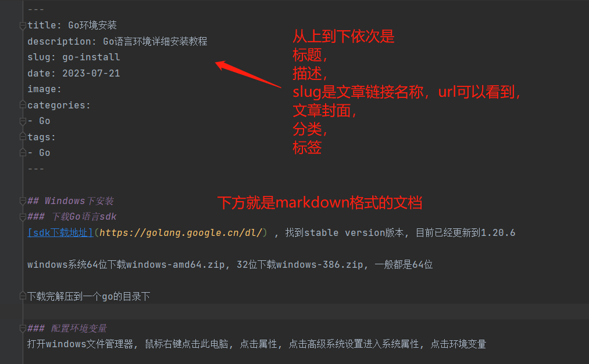


### 更多配置
更多详细的配置，可以去看作者的官方文档 **[Stack](https://stack.jimmycai.com/)**

里面包括 自定义页头页脚html内容， 开启评论， 嵌入视频， 图片等等

## 发布Github
在命令行博客目录下输入hugo，即可生成public目录，里面就是编译生成好的静态博客目录，只需要将该目录和远程仓库绑定即可

在Github分类下有一篇文章介绍创建远程仓库及使用git推送， 只需要创建一个bllon.github.io名称的仓库即可， bllon是我的名称，可以随意起名

接着我们在仓库设置下的Page下使用们的分支即可
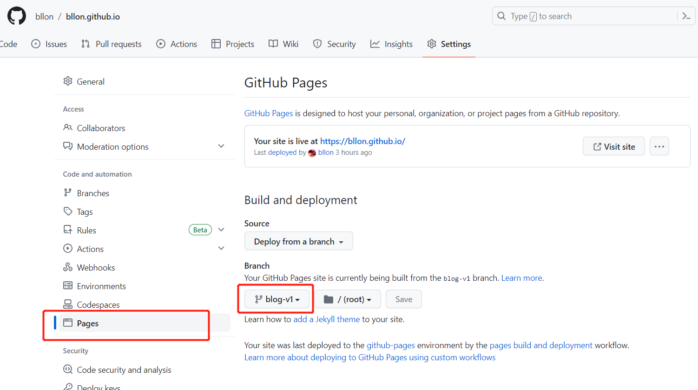

浏览器输入bllon.github.io即可访问我们的博客页面

## 配置Github Actions自动部署
**我们将博客目录作为一个推送仓库，每次提交到这个仓库，github的actions就会自动触发任务，
将自动编译得到public目录并推送到另一个仓库bllon.github.io**

只需要改动.github/workflows目录下的deploy.yml文件

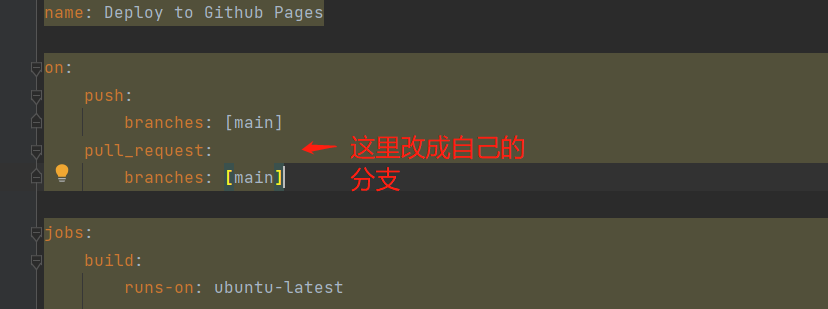

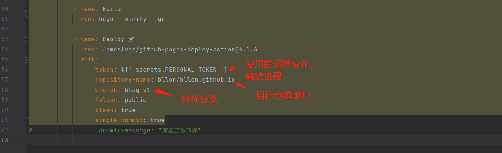

在项目仓库下的settings中创建 PERSONAL_TOKEN 环境变量
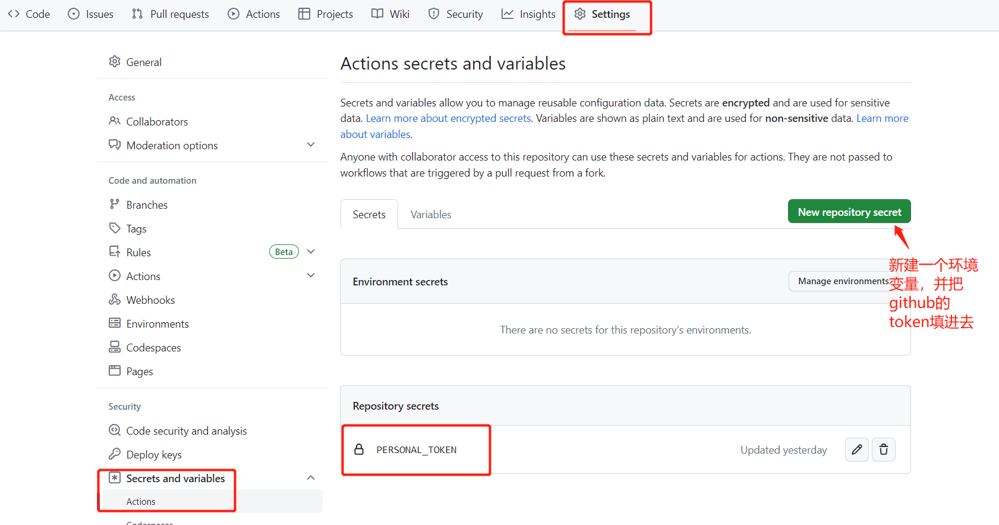

在项目仓库下的Actions中可以查看部署的任务，每次push提交远程仓库可以自动触发，也可以在GitHub仓库页面去执行和管理
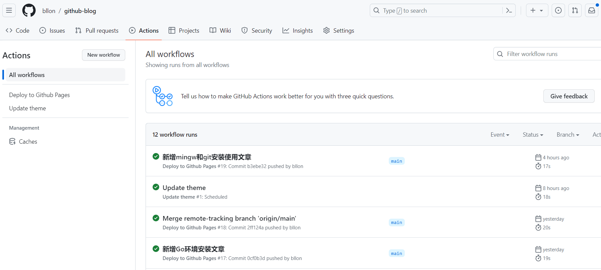

至此完整的hugo博客搭建流程完毕！